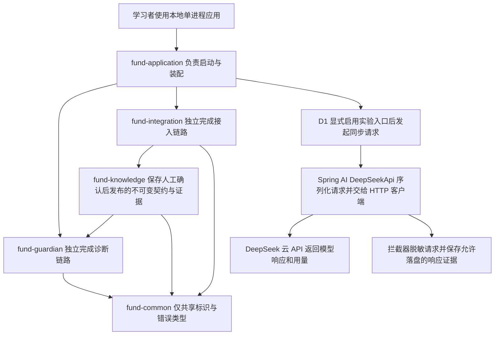

# 一页架构草图

上半部分是既定模块职责，D1 只建立空模块并由 app 装配，尚无业务实现。下半部分是 D1 已实现的调用路径，使用环境变量输入 key 与提示；默认启动不调用模型。

契约、本地治理配置、运行基线、历史故障保持分离；文档声明不能覆盖本地配置，模型不能猜测契约值。后续诊断固定证据版本，执行经过规则与审批，且只模拟。PostgreSQL + pgvector 在 M3 才接入，D1 无数据库。
