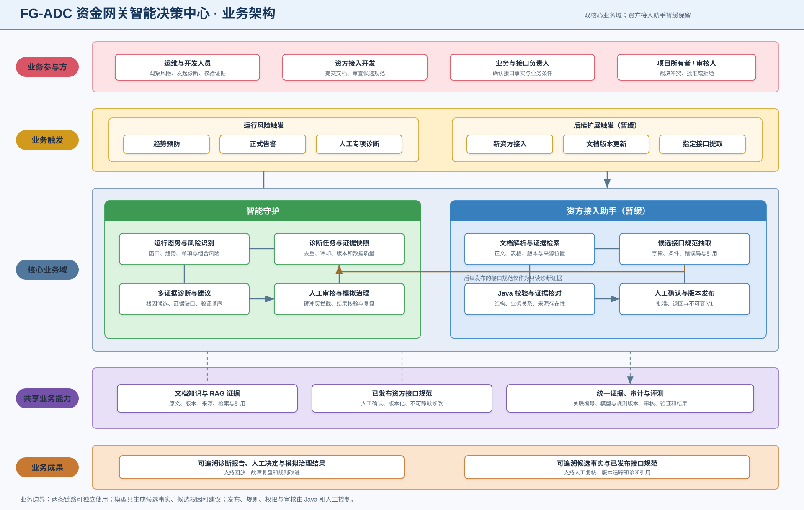

# 资金网关智能守护 Agent：业务架构

> 内部工程代号：FG-ADC 资金网关智能决策中心

## 业务目标

资金网关智能守护 Agent 用两个相互衔接的能力解决资金网关中的两类实际问题：

- 资方知识库把文档转成可检索、有来源的知识证据，降低人工查找和核对成本。
- 智能守护 Agent 把高频运行指标转成少量有证据的诊断任务，降低依赖个人经验排查问题的成本，并把治理建议置于 Java 门禁和人工审批之后。

两个能力可以独立演示，但对外统一作为“智能守护 Agent”的知识与诊断链路；知识库是智能守护的证据前置，资方接入助手保留现状，不进入本期主链路。

## 业务架构图

## 核心业务能力

| 业务域 | 输入 | 核心处理 | 输出 |
|---|---|---|---|
| 知识底座 | 资方文档、需求、复盘、手册 | 解析、切分、索引、检索、引用、评测 | 可追溯知识证据 |
| 资方接入助手（暂缓） | 文档证据与指定接口 | 既有候选抽取、Java 校验、人工确认、版本发布 | 已发布接口规范 V1 |
| 智能守护 | 合成指标、规则、接口规范和知识证据 | 聚合、风险、Agent 调查、门禁、审核 | 诊断报告与模拟治理记录 |

## 业务边界

- 运行指标属于结构化事实，不进入 RAG。
- 文档正文进入 RAG；人工确认后的接口事实进入结构化接口规范。
- 模型只生成候选事实、候选根因和建议，不能发布规范、判断确定性阈值或执行治理。
- 既有候选接口规范未经人工确认不可跨域使用；发布版本不可原地修改。本期不扩展该流程。
- 根因排序不同只记录；模型否认确定性规则、引用无效事实或提出越权动作时进入人工审核。
- 代码生成不是核心业务闭环；核心验收后只允许增加确定性 DTO/校验骨架演示。
