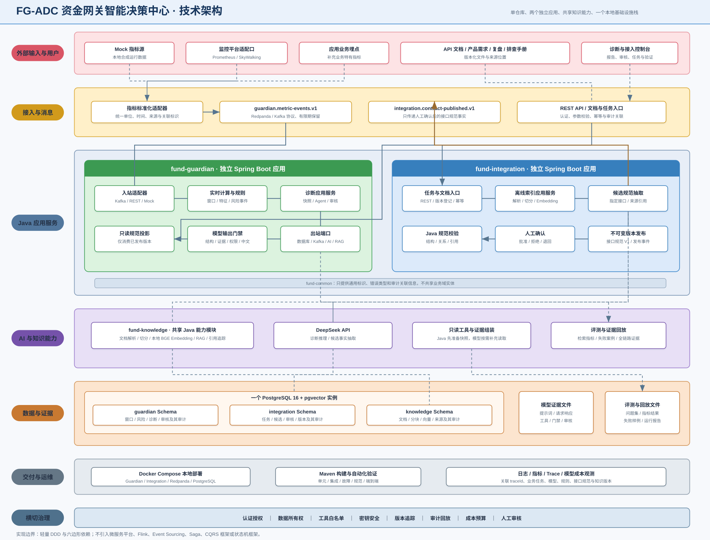
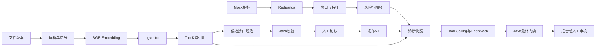

# 技术架构

## 技术目标

技术架构只服务两个闭环：可追溯 RAG 和受控 Agent。采用一个 Maven 仓库、两个最终可独立启动的 Spring Boot 应用、一个共享知识模块和最小本地基础设施，不建设通用 AI 平台。

## 技术架构图

## 模块职责

- `fund-knowledge`：文档解析、切分、本地 BGE Embedding、pgvector 检索、引用和评测。
- `fund-integration`：文档任务、候选接口规范、Java 校验、人工确认和不可变版本发布。
- `fund-guardian`：指标消费、窗口、规则、风险、诊断快照、Agent、门禁、审核和模拟治理。
- `fund-common`：通用标识、错误和审计关联信息，不放领域实体。
- `fund-experiments`：只保留 M0/M1 实验入口，不进入最终运行拓扑。

两个业务域内部采用轻量 DDD 与六边形依赖：入站适配器调用应用用例，应用层编排领域对象，基础设施实现出站端口。

## 核心数据流

## 基础设施

- PostgreSQL 16 + pgvector：一个实例，使用 `knowledge`、`integration`、`guardian` 三个 Schema。
- Redpanda：只承载 `guardian.metric-events.v1` 与 `integration.contract-published.v1`。
- DeepSeek：候选事实抽取和诊断推理；不负责数值计算、权限和状态转换。
- 本地 BGE：文档与查询使用同一模型、512 维和归一化配置。
- Docker Compose：最终启动 PostgreSQL/pgvector、Redpanda、fund-integration 和 fund-guardian。
- 本期不使用 Redis；幂等由 PostgreSQL 唯一约束保证，冷却与频控由应用逻辑和持久化时间字段完成。

## 数据所有权

- `knowledge`：文档、分块、向量、来源、索引版本和检索评测。
- `integration`：接入任务、候选规范、审核和发布版本。
- `guardian`：聚合窗口、风险、诊断快照、报告、审核和模拟治理。
- 审计记录随所属域保存，并通过 `traceId` 关联。
- 原始指标由 Redpanda 有限期保留，不永久复制全部遥测。

## AI 工程边界

Java 先准备结构化事实和主要证据，再允许模型通过白名单工具补充只读调查。模型输出必须映射为 Java 对象，并经过结构、证据、规则、权限和中文门禁。模型与确定性规则发生硬冲突时由人工裁决。

## 部署与验证

本地使用 Mock 指标和用户提供文档，不连接真实监控与资方系统。测试覆盖正常、单指标、多指标、重复风险、缺证、非法引用、越权、硬冲突及依赖故障。最终报告本机实测结果，不宣称生产容量或高可用。
